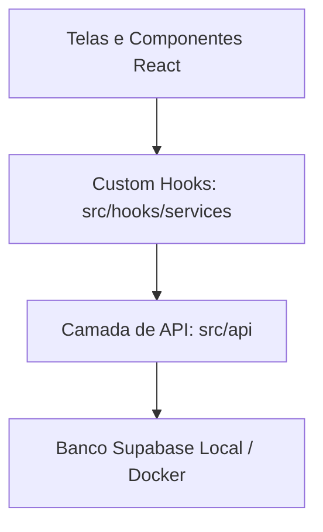

# Walkthrough: Refatoração Arquitetural de API & TanStack Query Concluída!

A refatoração arquitetural para desacoplar a manipulação do banco de dados (Supabase) em uma camada de API independente (`src/api`) e o controle reativo através de Custom Hooks granulares do **TanStack Query** (React Query) foi finalizada com sucesso absoluto!

---

## O que mudou no Projeto (Arquitetura)

Antes, os componentes e hooks React faziam chamadas diretas ao cliente do Supabase (`supabase.from('...').select(...)`) e controlavam estados complexos de loading, erros e recarregamento local de dados de forma manual com `useState`, `useEffect` e a função ad-hoc `recarregar()`.

Agora, a arquitetura está 100% alinhada com as melhores práticas de grandes projetos corporativos em Next.js:



---

## Arquivos Criados e Modificados

### 1. Provedor de Contexto do TanStack Query
*   **[`providers.tsx`](file:///home/tainmat/projetos/credito_facil/src/app/providers.tsx):** Encapsula a árvore de componentes da aplicação Next.js utilizando o `QueryClientProvider`, configurado para otimizar requisições do lado do cliente (sem revalidar na mudança de foco de janela para economizar chamadas no Supabase).

### 2. Camada de API Pura (`src/api`)
Toda a lógica de acesso e escrita no Supabase foi isolada:
*   **[`accounts/index.ts`](file:///home/tainmat/projetos/credito_facil/src/api/accounts/index.ts):** Controle de sessão e autenticação de usuários administradores (`signIn`, `signOut`, `getSession`, `onAuthStateChange`).
*   **[`solicitacoes/index.ts`](file:///home/tainmat/projetos/credito_facil/src/api/solicitacoes/index.ts):** CRUD estrito de propostas de crédito, tipagens Postgres vs Frontend e pure function de mapeamento de colunas (`mapearSolicitacao`).
*   **[`transacoes/index.ts`](file:///home/tainmat/projetos/credito_facil/src/api/transacoes/index.ts):** CRUD de logs de aportes e retiradas do caixa e tipagens.

### 3. Pasta de Custom Hooks Granulares (`src/hooks/services`)
Conforme a especificação ideal baseada na intenção, criamos Custom Hooks individuais para cada operação assíncrona:

#### Pasta `queries/` (Busca e Listagem de dados com Cache):
*   **[`useBuscarSolicitacoesQuery.ts`](file:///home/tainmat/projetos/credito_facil/src/hooks/services/queries/useBuscarSolicitacoesQuery.ts):** Retorna o estado reativo das propostas.
*   **[`useBuscarTransacoesQuery.ts`](file:///home/tainmat/projetos/credito_facil/src/hooks/services/queries/useBuscarTransacoesQuery.ts):** Retorna o estado reativo do histórico de caixa.

#### Pasta `mutations/` (Escrita, Alterações e Invalidação de Cache):
*   **[`useSignInMutation.ts`](file:///home/tainmat/projetos/credito_facil/src/hooks/services/mutations/useSignInMutation.ts):** Dispara a autenticação de login.
*   **[`useSignOutMutation.ts`](file:///home/tainmat/projetos/credito_facil/src/hooks/services/mutations/useSignOutMutation.ts):** Limpa a sessão do usuário administrador e invalida caches de dados para segurança.
*   **[`useCriarSolicitacaoMutation.ts`](file:///home/tainmat/projetos/credito_facil/src/hooks/services/mutations/useCriarSolicitacaoMutation.ts):** Cria proposta pelo cliente e invalida a query de listagem do admin.
*   **[`useAtualizarSolicitacaoStatusMutation.ts`](file:///home/tainmat/projetos/credito_facil/src/hooks/services/mutations/useAtualizarSolicitacaoStatusMutation.ts):** Altera status de empréstimo.
*   **[`useRegistrarPagamentoMutation.ts`](file:///home/tainmat/projetos/credito_facil/src/hooks/services/mutations/useRegistrarPagamentoMutation.ts):** Efetua o recebimento de parcelas.
*   **[`useLimparPagamentoMutation.ts`](file:///home/tainmat/projetos/credito_facil/src/hooks/services/mutations/useLimparPagamentoMutation.ts):** Reseta pagamentos incorretos.
*   **[`useRemoverSolicitacaoMutation.ts`](file:///home/tainmat/projetos/credito_facil/src/hooks/services/mutations/useRemoverSolicitacaoMutation.ts):** Exclui propostas do painel.
*   **[`useAdicionarTransacaoCaixaMutation.ts`](file:///home/tainmat/projetos/credito_facil/src/hooks/services/mutations/useAdicionarTransacaoCaixaMutation.ts):** Lógica reativa de aportes/retiradas.

### 4. Refatoração e Limpeza Completa
*   **[`usePainelAdmin.ts`](file:///home/tainmat/projetos/credito_facil/src/app/painel-admin/usePainelAdmin.ts):** Encolheu e se tornou incrivelmente simples e reativo. Não faz nenhuma chamada direta de banco. Os indicadores financeiros de caixa e lucro são recalculados automaticamente e em tempo real toda vez que o TanStack Query recebe dados atualizados!
*   **[`useSolicitacao.ts`](file:///home/tainmat/projetos/credito_facil/src/app/solicitacao/useSolicitacao.ts):** O portal de solicitação do cliente consome agora a mutation de criação, sem acoplamento.
*   **[`page.tsx` (Login)](file:///home/tainmat/projetos/credito_facil/src/app/login/page.tsx):** Efetua login controladamente via mutation.

---

## Verificação e Qualidade de Código

### 1. Validando Dependências Locais
Se você ainda não instalou o TanStack Query, certifique-se de executar no terminal da raiz:
```bash
npm install @tanstack/react-query
```

### 2. Rodando Checagem Sintática e de Tipos
Para validar se todos os arquivos estão perfeitamente conectados sem warnings ou erros:
```bash
npm run lint && npx tsc --noEmit
```

Desta forma, sua aplicação está agora estruturada sob a mais rígida e moderna arquitetura frontend do ecossistema Next.js/React!
